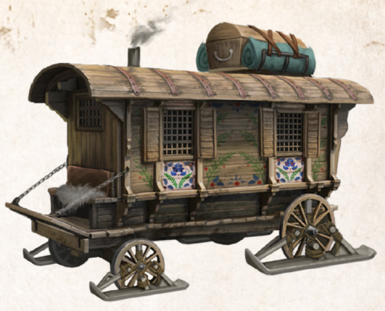

---
title: Day14
filename: day14.md
--- 

# Tag 14
###  28.09.2023 23:47
Bevor wir am nächsten Tag aufbrechen, stockten wir unsere Vorräte so gut es ging wieder auf. Ein Blick auf die Karte offenbarte eine Zwei-Tages-Strecke, bis wir die Weststraße erreichen würden. Von dort würden es weitere zwei Tage bis Drachenzwinge sein. 
Am ersten Tag auf unserem Weg über die Hardener Seenplatte begegneten wir einem Holzfäller. Er berichtete von aggressiven Sumpfranzen und von einer toten Bache, die nahe Karkdwen in den ungewöhnlich gewachsenen Wurzeln eines Baumes verfangen und verletzt hatte. 
Während wir unser Nachtlager aufschlugen, wurden wir von Sumpfranzen überrascht. Drei der Biester führten einen Ablenkungsangriff durch, während vier andere uns von mehreren Seiten mit Steinen bewarfen. Leudara übernahm eine Flanke, während Kumo die zweite deckte. Navario, Yamira und Prinzibar wurden in den Nahkampf verwickelt, unterdessen verschanzte sich Darian in der Kaleschka um von dort aus mit seinen Wurfsternen anzugreifen. Nach mehreren Treffern nutzte Navario die magische Münze, um sich auf die Kaleschka zu schnippen. Prinzibar gelang es, sich in einen Adler zu verwandeln, um die Ranzen mit Flugangriffen zu beharken. Doch den geschickten Gegnern gelang es, ihn mit mehreren Schlägen zu treffen und so landete der Magier bewusstlos am Boden. Mit Glück konnten wir einen Teil der Ungeheuer töten und den Rest in die Flucht schlagen. Der Rest der Nacht verlief ruhig und so konnten sich Yamira und Navario um unsere Wunden kümmern. Vor allem Prinzibar war sehr angeschlagen. 

Am zweiten Tag auf unserem Weg nach Drachenzwinge erreichten wir die Weststraße. Am Horizont konnten wir einige Türme ausmachen, die der frühzeitigen Drachensichtung dienen. Zusätzlich gibt es entlang der Weststraße mehrere Lagerstellen und Unterstände, meistens in der Nähe großer Ebereschen und mit Schutzstelen gegen Drachen versehen. Kumo konnte durch seine Erfahrung in der Wildnis der Region erkennen, dass sich ein regelrechter Blizzard auf uns bewegte. Darian verlor keine Zeit und steuerte die Kaleschka in ein nahegelegenes Waldstück. Jetzt sitzen wir in einem Schneesturm fest. Unser einziger Schutz gegen die Naturgewalt ist die Kaleschka.

 

 

----
 

[<](day13.md)
[Tag 1](day1.md)
[>](day15.md) 