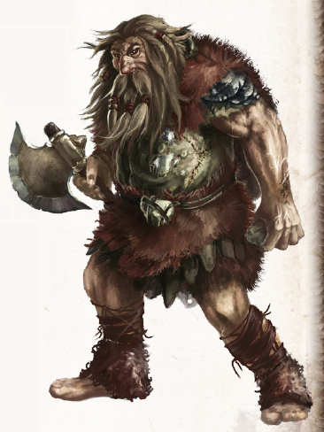

---
title: Day16
filename: day16.md
--- 

# Tag 16
###  28.11.2023
Am nächsten Morgen untersuchten wir die Stelle, an der wir den Hirsch aus dem Wasser gezogen hatten, fanden jedoch keine nützlichen Hinweise auf das Geschehene. Wir überquerten die Brücke und folgten der Straße ins Gebirge. Nach kurzer Zeit entdeckten wir eine eigenartige Schneewehe. Bei genauerer Betrachtung erkannten wir, dass es sich um eine auf das Dach geworfene Kaleschka handelte. Navario entdeckte im Schnee riesige Fußspuren. Er vermutete, dass ein Troll dafür verantwortlich war. Vorsichtig näherten wir uns der Kaleschka, in ihrer Nähe ein einzelnes Pferd mit einer nur mäßig versorgten Wunde an der Flanke.

Im Inneren der Kaleschka wärmte sich der Händler Aljeg Ragaschoff an einem kleinen Kohlebecken. Auf die Frage, wie er in diese Lage gekommen war, erzählte er, dass ein Troll die Kaleschka umgeworfen und seinen Honig geplündert hat. Als wir ihn damit konfrontierten, dass er dämonische Waren verkauft habe, beteuerte er, dass er in Yol-Ghurmak hintergangen wurde. Wir konnten Leudara davon überzeugen, ihn nicht an Ort und Stelle hinrichten, jedoch bestand sie darauf ihn als Ketzer auf der Stirn zu brandmarken. Als dank für sein Leben durften wir uns eine verzauberte Linse aus seinem Sortiment mitnehmen. Damit überließen wir ihn seinem Schicksal. 
Auf einem verschneiten Pfad ins Gebirge entdeckten wir einen zurückgelassenen Honigtopf, den die Goblins während des Trommelverkaufs gestohlen hatten. Nach einigen Kletterpassagen nutze Prinzibar seine Adlergestalt um die Umgebung zu überblicken. Zwar konnte er keine Goblins sehen, bemerkte jedoch eine Gruppe Trolle nicht allzu weit von uns. Navario suchte uns einen Pfad an ihnen vorbei, dieser führte uns glücklicherweise zu Spuren von Goblins. Diese hatten einen einzelnen Troll überfallen und getötet. Neben dem Leichnam des Trolls waren Reste von großen Honigtöpfen zu sehen. Wir versuchten, den Spuren der Goblingruppe weiter zu folgen, verloren sie jedoch im unwegsamen Gelände. Uns gelang es, mehreren Fallen auszuweichen und schlugen unser Lager auf. Navario nutze seine magischen Kräfte um die Umgebung durch die Augen von Kleintieren zu sehen. Zu seiner Überraschung konnte er Schweine in einer Höhle sehen. Die Höhle der Goblins musste irgendwo in der Nähe sein. Mit neuer Hoffnung ruhten wir für diese Nacht. 
Da die Nachtwache ebenfalls eingeschlafen war, wurden wir von einer donnernden Stimme geweckt: „Wimmelkriegers, sprech! Wir such Raugatsch. Was wiss Wimmelkriegers? Trollse verlauf nicht auf Imithridatsch und Stein und Tier ist kein Gefahr. Also: sprech!“ 
Navario erholte sich als erster vom Schrecken und konnte den Troll und seinen drei mit kleinen Bäumen bewaffneten Gefährten davon überzeugen, dass wir “Raugatsch” gefunden haben und er von Goblins überfallen wurde. Wir führten die vier grimmigen Gestalten zum Ort des Überfalls. Als Dank zeigte uns ihr Anführer, wo die Goblinhöhle zu finden war, danach trugen sie den Gefallenen fort. Zum Abschied hinterließ er uns noch eine kryptische Warnung: 

*„Nutzlos Kleinlings! Wimmelkriegers und Kleinstruppige!  
Wiss nichts von Imithridatsch und nichts von uralt Land.   
Dumm wie Himmelsgötters! Kleinstruppige lauf und suhl, viel alt, wenig bleib.   
Wimmelkriegers lauf und lärm, aber nichts versteh!   
Wart, Wimmelkriegers!   
Wenn Einer komm über groß Berg, wenn Einer komm nach tausend Jahr  
und schmeiß runter Himmelslichters, dann seh!   
Dann uralt Land zu schwach mit euch, und Untergang!“* 
 
Wir kletterten über Geröllpisten in die uns gezeigte Richtung. Darian und Navario retteten Yamira vor einem Sturz ins sichere Verderben. An einer Steilwand angekommen, mussten wir einem schmalen Pfad dem Fels entlang folgen. Als uns plötzlich Goblins von oben mit Steinen bewarfen, blieb uns nichts übrig, als zu rennen. Wir erreichten einen Hohlweg und konnten so dem Guerilla-Angriff entkommen. Dem Pfad folgend stießen wir auf einen Höhleneingang. Davor war Drachendung platziert worden, um Tiere fernzuhalten, und an den Wänden waren verblasste Malerein in Ocker, Grün und Blau. Einzig ein Bild direkt über dem Eingang war klar erkennbar, ein Eichelhäher in Schwarz und Ockerfarben.


 

----
 

[<](day15.md)
[Tag 1](day1.md)
[>](day17.md) 